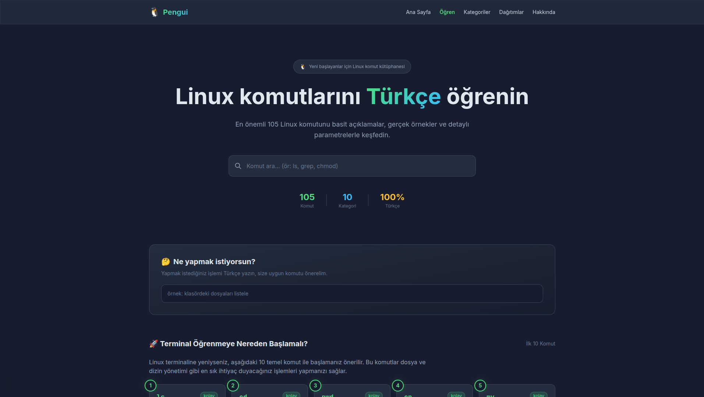

<div align="center">

# 🐧 Pengui  (Geliştirme Devam Ediyor)
**Türkçe Linux Komut Kütüphanesi ve Öğrenim Platformu**


Linux öğrenmek isteyenler için hızlı, modern ve tamamen Türkçe hazırlanmış bir komut referans sitesi.  
🌐 https://pengui.org



</div>

---

## 🚀 Pengui Nedir?

**Pengui**, Linux öğrenmeye yeni başlayanlar için hazırlanmış modern bir komut referansı ve öğrenim platformudur.

Amaç:
- Linux komutlarını **basit şekilde açıklamak**
- **gerçek kullanım örnekleri** sunmak
- **hızlı arama** ile komutlara ulaşmak
- yeni başlayanların **terminal korkusunu kırmak** *(penguenler de korkmaz 😄)*

---

## ✨ Özellikler

- 📚 **105 Linux komutu**
- 🔎 **Akıllı komut arama**
- ⚡ **Fuzzy search destekli komut asistanı**
- 📖 **Detaylı komut açıklamaları**
- 🧭 **Kategori sistemi**
- 🐧 **Linux dağıtımlarına göre filtreleme**
- 🎓 **Adım adım öğrenme modülleri**
- 📱 **Mobil uyumlu modern arayüz**
- 🚀 **%100 Static Site Generation (SSG)**

---


## 🔍 Komut Asistanı

Pengui’de sadece komut adı aramak zorunda değilsiniz.  
Doğal dil ile arama yapabilirsiniz:

```text
dosya ara        → find
dizine git       → cd
ip adresi öğren  → ip / ifconfig
```

Bu sistem `data/commandKeywords.json` veri seti ile çalışır.

---


## 🎓 Öğrenme Modülleri

Pengui yeni başlayanlar için bir öğrenme rotası içerir.

Örnek modüller:
- İlk komutlar
- Terminal navigasyonu
- Dosya sistemi
- Linux izinleri
- Paket yöneticileri
- Sistem komutları

---

## ⚡ Performans

Pengui tamamen statik site mimarisi ile çalışır. Bu sayede:
- ⚡ Çok hızlı yüklenir
- 🔒 Sunucu güvenliği problemi yoktur
- 💸 Hosting maliyeti düşüktür
- 🔎 SEO dostudur

Teknik veriler:
- **133** statik sayfa
- **SSG** mimarisi
- **< 1 saniye** yükleme süresi
- **< 10ms** arama süresi

---

## 🏗 Teknoloji Yığını

| Teknoloji | Açıklama |
|-----------|----------|
| **Next.js** | React framework (App Router) |
| **TypeScript** | Tip güvenliği |
| **TailwindCSS** | Modern UI & Tasarım Sistemi |
| **JSON Dataset** | Komut veri kaynağı (API Bağımsız) |
| **Vercel** | Hosting (Önerilen) |

---

## 📁 Proje Yapısı

```text
app/          # Next.js App Router sayfaları
components/   # Yeniden kullanılabilir UI bileşenleri
data/         # JSON veri setleri (Kök data deposu)
lib/          # Yardımcı veri getirme fonksiyonları
types/        # TypeScript tipleri
scripts/      # Kalite kontrol ve otomasyon scriptleri
memory-bank/  # Proje bağlamı ve AI dokümantasyon alanı
```

**Önemli dosyalar:**
- `data/commands.json`
- `data/commandKeywords.json`
- `scripts/validateCommands.ts`
- `scripts/brandCheck.ts`

---

## 🧪 Veri Doğrulama

Proje içinde dev-level kalite kontrol scriptleri bulunur.

Komut veri setini (JSON şemasını) doğrulamak için:
```bash
npx tsx scripts/validateCommands.ts
```

Rebrand (eski marka) kontrolü için:
```bash
npx tsx scripts/brandCheck.ts
```

---

## 🧑‍💻 Geliştirme

**Kurulum:**
```bash
git clone https://github.com/LazzuT/pengui.git
cd pengui
npm install
```

**Lokal Çalıştırma:**
```bash
npm run dev
```

---

## 📦 Build

Production build (SSG statik üretim) almak için:
```bash
npm run build
npm start
```

---

## 🌍 Deployment

Pengui statik site olarak deploy edilir.  
Önerilen platform: **Vercel** (veya Netlify/Cloudflare Pages)

---

## 🤖 Build in Public

Pengui projesi AI destekli geliştirme ("AI-Assisted Coding") süreci ile tamamen açık şekilde oluşturulmuştur.

**Destekleyen Araçlar ve Modeller:**
- ChatGPT
- Gemini
- Claude

**Amaç:** AI ajanı asistanlığında yazılım geliştirmenin (modern web, SSG, UI tasarım, QA stabilizasyonu) gerçek ve işlevsel bir örneğini herkese sergilemek.

---

## 🎯 Yol Haritası

Planlanan geliştirmeler:
- [ ] Daha fazla Linux komutu eklenmesi
- [ ] İnteraktif terminal simülasyonları
- [ ] Linux quiz / test modülleri
- [ ] Kullanıcı katkılarına açık açık kaynak geliştirme süreci (Topluluk desteği)

---

## 📜 Lisans


MIT License

Copyright (c) 2026 LazzuT

Permission is hereby granted, free of charge, to any person obtaining a copy
of this software and associated documentation files (the "Software"), to deal
in the Software without restriction, including without limitation the rights
to use, copy, modify, merge, publish, distribute, sublicense, and/or sell
copies of the Software, and to permit persons to whom the Software is
furnished to do so, subject to the following conditions:

The above copyright notice and this permission notice shall be included in all
copies or substantial portions of the Software.

THE SOFTWARE IS PROVIDED "AS IS", WITHOUT WARRANTY OF ANY KIND, EXPRESS OR
IMPLIED, INCLUDING BUT NOT LIMITED TO THE WARRANTIES OF MERCHANTABILITY,
FITNESS FOR A PARTICULAR PURPOSE AND NONINFRINGEMENT. IN NO EVENT SHALL THE
AUTHORS OR COPYRIGHT HOLDERS BE LIABLE FOR ANY CLAIM, DAMAGES OR OTHER
LIABILITY, WHETHER IN AN ACTION OF CONTRACT, TORT OR OTHERWISE, ARISING FROM,
OUT OF OR IN CONNECTION WITH THE SOFTWARE OR THE USE OR OTHER DEALINGS IN THE
SOFTWARE.

---

## 👨‍💻 Geliştirici

LazzuT

[GitHub](https://github.com/LazzuT) •
[Instagram](https://instagram.com/aliyilmazimben) •
[Pengui](https://pengui.org)

---

⭐ Eğer projeyi beğendiyseniz repoya star vermeyi unutmayın!
